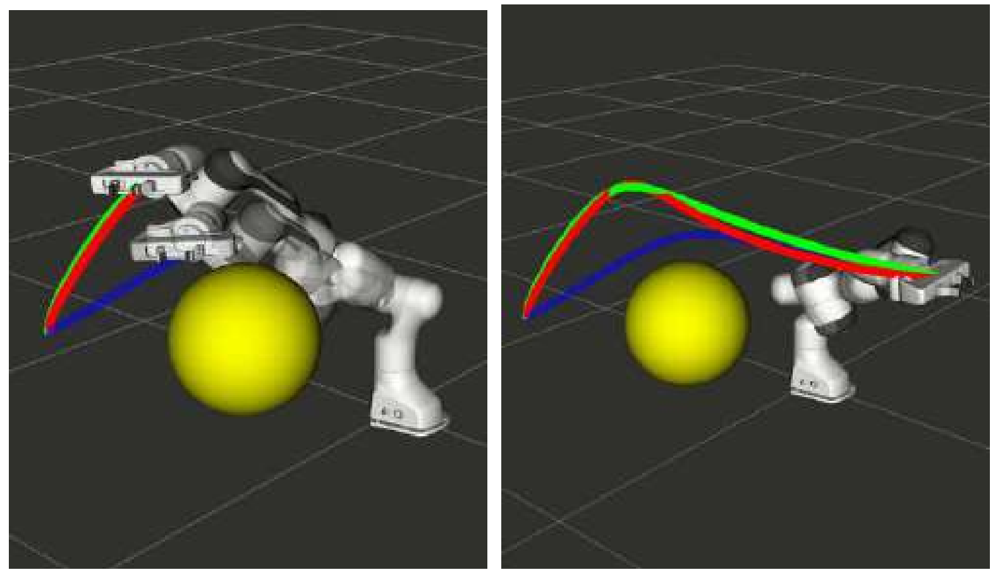

# task-perturbation-argmin

#### [Shashank Srikanth](https://scholar.google.com/citations?user=LjiaV8MAAAAJ&hl=en), [Mithun Babu](https://scholar.google.com/citations?user=vTZ__OUAAAAJ&hl=en), Houman Masnavi, Arun Kumar Singh, Karl Kruusamäe, and K. Madhava Krishna

Final Configuration Perturbation | Mid-point perturbation
:-------------------------:|:-------------------------:
  |  

This repository contains code and data required to reproduce the results of "Fast Adaptation of Manipulator Trajectories to Task Perturbation By Differentiating through the Optimal Solution" ([arXiv](https://arxiv.org/abs/2011.00488))

### Datasets

The datasets used for our experiments are provided in the `dataset` folder of this repository. The 4 datasets have different level of perturbation as mentioned in the paper. 

Each dataset has 6 trajectories on which we perform several perturbations for a given task. The number of perturbation trajectories in a given trajectory can be different.

### Installations

The code has been tested with `python3`. 

In order to install all the required files, create a virtualenv and install the files given in `requirements.txt` file.

```
virtualenv -p python3.7 ENV_NAME
source ENV_NAME/bin/activate
pip install -r requirements.txt
```

### Running the code 

#### Final Position Perturbation

In order to run the final position perturbation code, first generate the solver solutions for the given datasets using the following lines:

```
python generate_solver_soln.py --traj_num TRAJ_NUM  --results_path ./results/dataset_xlarge --dataset_path ../dataset/dataset_xlarge.npy
```

Now, pass the above `results_path` in the command below to get the argmin solution.

```
python new_formulation.py --traj_num TRAJ_NUM --results_path RESULTS_PATH --soln_path ./results/dataset_xlarge --dataset_path ../dataset/dataset_xlarge.npy
```

Here `soln_path` refers to the path where the initial solver trajectories are stored. 